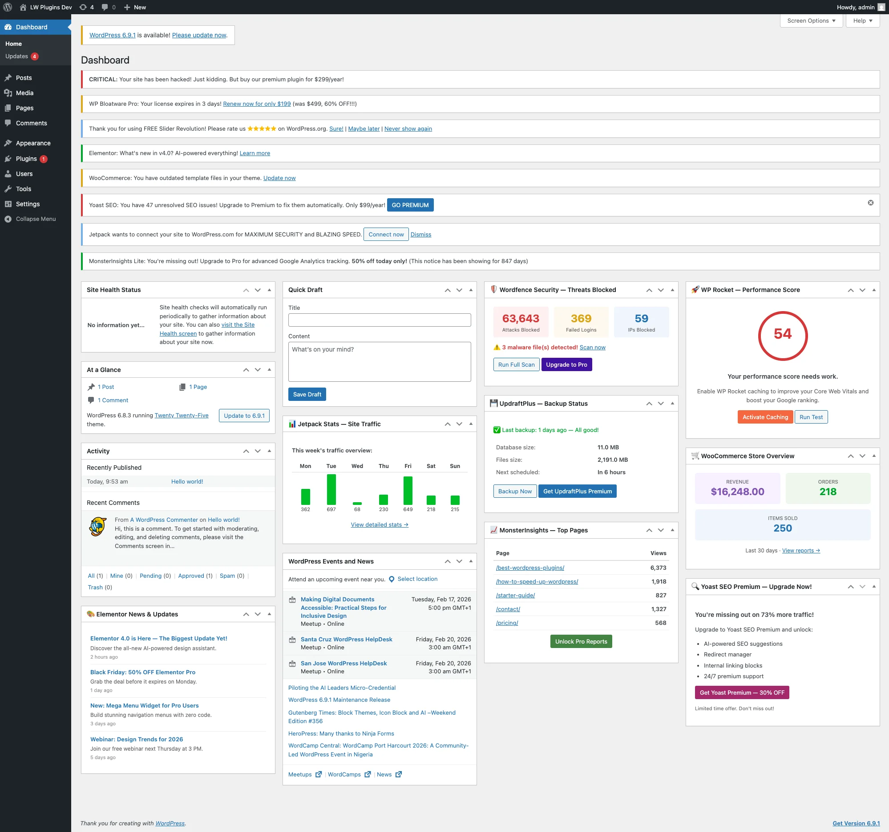
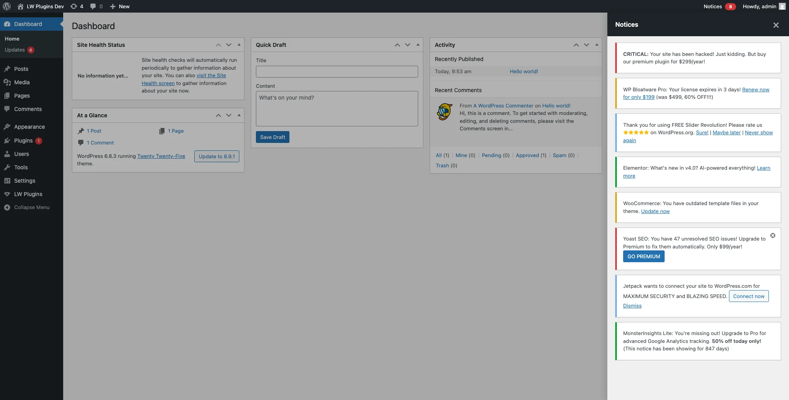

# Lightweight ZenAdmin

Clean up your WordPress admin — collect notices into a sidebar panel and manage dashboard widgets.

[](https://php.net)
[](https://wordpress.org)
[](https://www.gnu.org/licenses/gpl-2.0.html)

## Before & After

| Before | After |
|--------|-------|
|  |  |

## Features

### Notice Collector

Collects all admin notices into a slide-in sidebar panel accessible from the admin bar.

- **Admin bar button** — "Notices" label with a live badge count
- **Sidebar panel** — slides in from the right with all collected notices
- **Flash-free** — early CSS hides notices before JS loads
- **Dynamic** — picks up notices generated during plugin updates/installs
- **Multiple close methods** — Escape key, overlay click, or X button

### Dashboard Widget Manager

Controls which widgets appear on the WordPress dashboard, grouped by source.

- **Auto-discovery** — detects all registered dashboard widgets automatically
- **Grouped display** — WordPress Core, WooCommerce, Third-party
- **Sensible defaults** — Core + WooCommerce visible, Third-party hidden
- **Checkbox UI** — simple table interface on the settings page

### WP-CLI

Full CLI support for toggling features and managing widget visibility.

```bash
# Feature management
wp lw-zenadmin status
wp lw-zenadmin enable notices_enabled
wp lw-zenadmin disable widgets_enabled

# Widget management
wp lw-zenadmin widget list
wp lw-zenadmin widget show dashboard_quick_press
wp lw-zenadmin widget hide dashboard_primary
wp lw-zenadmin widget show-all
wp lw-zenadmin widget hide-all
wp lw-zenadmin widget reset
```

See [docs/CLI.md](docs/CLI.md) for the complete command reference.

## Installation

```bash
composer require lwplugins/lw-zenadmin
```

Or download and upload to `/wp-content/plugins/`.

## Usage

1. Go to **LW Plugins → ZenAdmin**
2. Toggle Notice Collector and Widget Manager on/off
3. Configure widget visibility in the Widgets tab

## Settings

| Option | Default | Description |
|--------|---------|-------------|
| `notices_enabled` | `true` | Enable/disable the notice collector |
| `widgets_enabled` | `true` | Enable/disable the widget manager |

Widget visibility is stored separately and can be managed from the admin UI or CLI.

## Documentation

- [CLI Commands](docs/CLI.md)
- [Hooks Reference](docs/HOOKS.md)

## Development

```bash
# Install dependencies
composer install

# Run code sniffer
composer phpcs

# Fix coding standards
composer phpcbf
```

## Links

- [GitHub](https://github.com/lwplugins/lw-zenadmin)
- [LW Plugins](https://lwplugins.com)

## License

GPL-2.0-or-later
